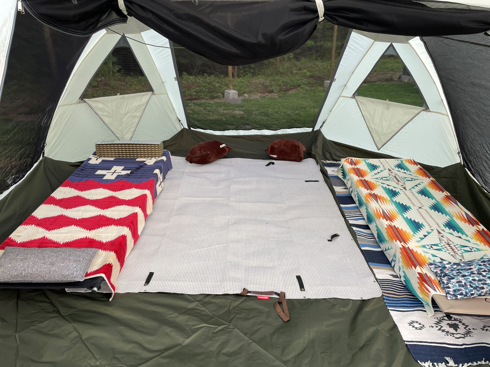

前回もっと大きいテントが欲しいと悩んでいる記事を書きましたが、
ついに買いました！

ロゴスの<a target="_blank" href="https://www.logos.ne.jp/products/info/4498">グランベーシック スペースベース・オクタゴン-BJ</a>です。  
アルペンにドームテント探しに行ったのですが、その場の割引がすごくて決めました。

この色がいい。かわいい。  
高さ215あるので快適です。  
メッシュでけっこう調整できるのでたぶん夏も冬もいけるはず・・・。

ロゴスの謎システムでドームテントの中ではかなり設営が楽なようです。  
最初はうまくできなくて途方にくれましたがコツを掴めばドームテントにしては短い時間で設営できそうです。  
ただ、二人でやったほうがよさそう。

中はこんな感じです。

下は関連製品のグランドシートひいてます。  
その上にコールマンのピクニックシート。  
このサイトは下が小石多かったのでグランドシートだけだと痛かったです。

夫はもともとコット派でしたが私もこれを機に買いました。  
コット上はペンドルトン。右コット下はロゴスのコットンラグです。（これすごいかわいいので買い足したい）

おしゃれレイアウトとはほど遠いですが・・・  
テントが広くなったのでレイアウトを考える楽しみが増えました。  
犬も走り回って楽しそうにしているのでよかったかなと思います。

ただ、荷物がかなり多くなってきたのでレンタカーへの積み下ろしが大変・・・。  
次は車かな・・・って感じです。
