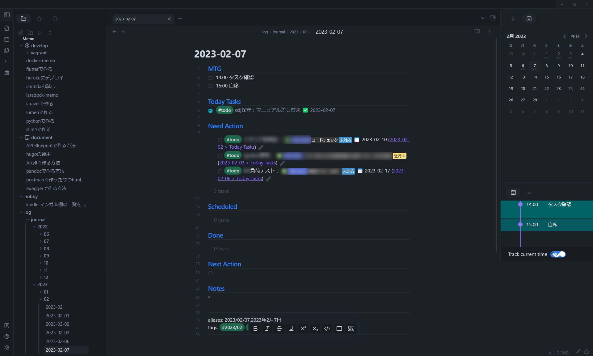

ようやくObsidianを使った日々のタスク運用が固まってきたのでいったんまとめておきたいと思います。

###### 今までの運用

会社のタスク管理はJira。  
ただ、ここで管理しているタスクはリリース日に向けて動いていく少し大きいタスクなので、
今日何をするのか、などの細かい管理には向かない。  
これを解決するために、自分だけのタスク管理としてGitKrakenのカンバンツールを使ってGTDみたいなことをしていたが、  
会議が増えてタスク以外のことも記録しておきたくなったのと、  
大量の次のタスクにうんざりしてすべてを表示しておかなくてもいいか・・・となった。  
（あとサービスも終わった）

###### Obsidianについて

<a target="_blank" href="https://obsidian.md/">Obsidian</a>は、PCにインストールして使うソフトウェア。  
PC上のmdファイルを管理できる。  
大きな特徴はファイル同士のつながりをグラフィカルに表示して思考の整理につなげたりできることだと思うが、  
私はこの機能は使っていない。  
プラグインが豊富なので自分好みにカスタマイズできる。

###### 導入プラグイン

先に、使っているプラグインを紹介する。（必須のみ抜粋）  
（前提として、コア機能のデイリーノートをONにしている）

Calendar  
カレンダーウィジェット。日付をクリックするとその日の日報にすぐ飛べる。

Day Planner  
リストを作成して設定すると、タイムラインを作ってくれる。次の予定の通知もしてくれる。

Periodic Notes  
日報だけでなく月報も、決めたフォルダに雛形から自動生成してくれる。

Tasks  
タスクに期限をつけたり、SQLみたいに抽出できるようになる。

Jira Issue  
JIRA番号を入力すると、タイトルなどを保管してリンクにしてくれる。

###### Obsidianを使った運用

Obsidianを起動すると雛形から自動生成された日報が開いた状態になっている。  
Need ActionやScheduledには、今まで登録したタスクで終わっていないものや、  
今日が期限のものなどが自動的に表示されている。

MTGカテゴリに、今日の会議を転記してタイムラインを作成する。  
今日やろうと思っていたタスクが別にあるならToday TasksにJIRA番号を使って記録する。  
（PJ開始時などタスクが無限にある場合はだいたい1週間でできる範囲で入力）  
割り込みタスクが入るたびにToday Tasksに記録していく。

タスクの単位は機能単位（JIRA）とかではなく、なるべく細かい単位（開発と検証を別にするとかそんなレベル）で記載。

タスクが終わったらチェック。自動的にDoneに移動となる。

今日はやらないけど少し先にやると決めたタスクはNext Actionに期限や実施日などを入れて記録。

そのほかメモなどがあればNotesに記録。

月報は、月初めに作成するが、その時点ではざっくり予定していることをメモするのみ。  
自動的にDoneを集計するエリアを作っておいて、振り返りで利用する。

#

Tasksのおかげで実用的な日報ができてきた気がします。  
日報以外の閲覧回数の高いメモも基本mdで書いて管理するようにしました。  
なにより起動が速い。素晴らしいです。
