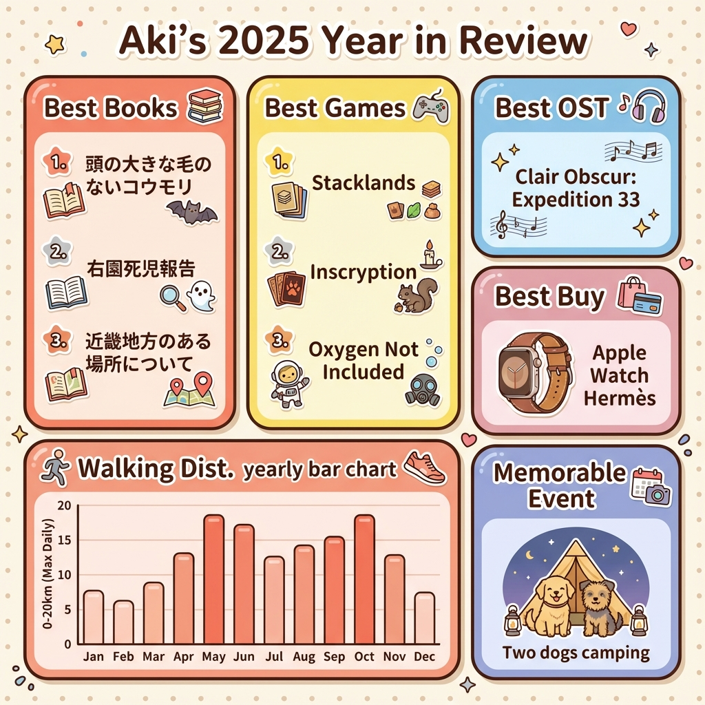

総括回です。  
画像はGeminiに作ってもらいました。

###### 今年出会った良い作品・出来事

日付なし **二匹目の犬**

今年はなんといっても年始早々に二匹目の犬をお迎えし、  
その子を中心にバタバタした一年だった。  
二匹目とはいえ犬種も違うからか一匹目とまったく違う性格・行動で  
やんちゃが過ぎて夜間救急病院にかけこんだりと一匹目では経験したことのない事件があったり・・・  
とはいえとても甘えん坊で活発で見ていて飽きない子で、彼のおかげで楽しい一年を過ごすことができた。

日付なし **デジタルプランナー**

今年はCozyleigh Studiosのデジタルプランナーで一年過ごした。  
書き込みはiPadでGoodnotesを使用。  
スタンプを押せるのは可愛くて楽しかったが、何か書くのは細かすぎて正直辛かった。  
英語ならいいんだろうか・・・。  
ただ、最終的に一年を振り返ってみると写真などまとまっていて楽しい記録にはなったと思う。  
来年も続けるかどうかはまだ悩み中！

1/1 **Core Keeper** ゲーム

誰かと一緒にやるならとっても楽しいゲーム。  
なので、実家でみんなで遊んだ。

2/12 **Inscryption** ゲーム

面白すぎて弟にすぐおすすめした。  
ゲーム性がどんどん変わるので飽きないし、飽きさせない工夫もすごい。

3/7 **Disco Elysium** ゲーム

独特なゲームで人を選ぶと思うけど私は面白かった。  
EDも何個か見た。

4/5 **Graveyard Keeper** ゲーム

かなりハマった。これも人を選びそうだが。  
Switch版でやったけど強制終了エラーが多くて本当につらくて、  
Disco～もそうだったのでインディーズゲームは今後はSteamで買おうと思った・・・。

4/12 **魔女の子供はやってこない** 本

矢部嵩さんの本はなんだかんだで色々読んでいる。  
読むとしんどさを感じることも多いんだけど、感心したり笑えたり・・・必ず感想がもてる。

5/17 **Stacklands** ゲーム

人生ベスト3ぐらいに入る好きなゲーム！  
かなり昔のゲームなんだけどこのスタイルでずっと何か出してほしい・・・。

6/1 **The Case of the Golden Idol** ゲーム

こういうゲームあまりやったことがなくて面白かった。  
DLCもやったんだけど、これだけSteam Deckでできないのはひどいよ・・・。

6/3 **夕映えてシアン** 芸術

昔どこかの展示会で知ってからずっと何か買いたいなと思っていて、ようやく。  
リビングを飾る大き目の絵を購入。素敵。

6/20 **Curious Expedition 2** ゲーム

1もやって、それはそれで面白かった。別物。  
こっちは一応ストーリーみたいな流れがあって、長く楽しめる。  
こういうゲームもあまりやったことがなくて面白かった。

7/10 **Oxygen Not Included** ゲーム

寝ても覚めてもずっとやっていた。生活が終わるレベル・・・。  
なんとか終わったけど、参考情報が多すぎて自分でちゃんとやったかというと微妙。  
DLCありもやりたいけど、うまくやれる自信がなくて積んでる。

9/5 **マシンチャイルド** ゲーム

待ったかいがありました。  
ED数も多くて大満足。

9/11 **さかさ星** 本

好きなタイプの内容で面白かった。  
次があるらしいので期待。

9/22 **犬二匹連れキャンプ**

二匹目の犬もキャンプデビュー。  

9/28 **右園死児報告** 本

カクヨムのホラーにはまった時期。  
こんなの無料で読めるのすごすぎる。  
他は、「濁唾濔蓏」を楽しみに読んでいるんだけどなかなか更新されない。

11/5 **ドラゴンクエストI＆II** ゲーム

特に2がよかった。  
みんなが可愛くて修学旅行みたいで・・・。  
3とはまた違う良さ。

12/4 **オクトパストラベラー0** ゲーム

1はそこまではまらず、2は未プレイ。  
でもこれは面白かったな。なんでかはわからないけど・・・。  
とにかくすごいボリュームだ。

4月にSteam Deckを買ったのもあってかゲームに時間を割くことが多かったな。  
でも色々なゲームに出会えて楽しい1年だった。  
来年もすでに楽しみなゲームがあるので同じような感じになりそうだ。
